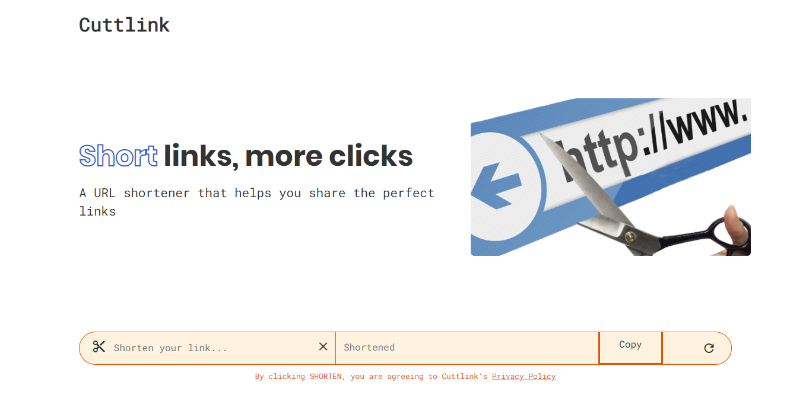

<h1 id="header" align="center"> 🔗 Cuttlink </h1>

<h4 align="center">Short links, more clicks</h4>

A simple URL shortening service that helps you share the perfect links!

---

---

## ✨ Features

- **Copy To Clipboard** (Copy your shortened links easily at just a button click)
- **Guest Service** (Anyone can create shortened links)
- **Public API** ([Cuttlink for developers](./server/API_DOC.md))

## 🌴 Branches

- [`main`](https://github.com/danBamikiya/cuttlink/tree/main) - production ready code
- [`dev-features`](https://github.com/danBamikiya/cuttlink/tree/dev-features) - where features implementation happen
- [`dev-fixes`](https://github.com/danBamikiya/cuttlink/tree/dev-fixes) - where broken stuffs are fixed

**others**

- [`nginx`](https://github.com/danBamikiya/cuttlink/tree/nginx) - where I implemented an NGINX reverse proxy for the NodeJS server and an NGINX web server to serve bundled Angular code in production
- [`db`](https://github.com/danBamikiya/cuttlink/tree/db) - where I'm currently implementing a PostgreSQL database for the app and a PostgreSQL admin database for management in the dev environment
- [`docs-changes`](https://github.com/danBamikiya/cuttlink/tree/docs-changes) - where adding, fixing and improvement of documentations happen
- [`infrastructure`](https://github.com/danBamikiya/cuttlink/tree/infrastructure) -
  - where I'll be writing Kubernetes configurations for containers orchestration
  - where I'll be using Terraform as Infrastructure as Code for provisioning cloud services for a staging and production environment

## ⌛ Status

Version [1.0.0-alpha pre-released](https://github.com/danBamikiya/cuttlink/releases), awaiting version 1.0.0

✅ **Web UI:** Built the web UI with Angular 11.  
✅ **NodeJS server:** Built the NodeJS server with ExpressJS to:

- Serve our API
- Shorten long urls

✅ **Dockerize:** Containerized the services using Docker with Docker Compose for easier management.  
✅ **Caching:** Implemented a Redis server in a container to store long urls and their short codes.  
✅ **Reverse Proxy:** Implemented an NGINX reverse proxy in a container to reverse proxy requests to our NodeJS server.  
✅ **Web Server:** Implemented NGINX as a web server in our frontend container to serve our compiled angular build in production.  
✅ **Error tracking:** Error tracking handled by [Sentry](https://sentry.io/welcome/) which is integrated into our NodeJS server logger.  
✅ **Rate limiting:** Implemented rate limiting on our API with a maximum of 100 requests per 3 mins per user IP.  
⌛️ **PostgreSQL Database:** [Implementing](https://github.com/danBamikiya/cuttlink/tree/db) a PostgreSQL database in a container to store long urls and their short codes.  
⌛️ **Containers Orchestration:** Write Kubernetes manifests to manage Docker services.  
⌛️ **Provision cloud resources:** Provision the cloud infrastructures(resources) the app will need using Terraform.  
⌛️ **Continuous Delivery Pipeline:** Implement a continuous delivery pipeline using Github Actions.   

## 📚 Tech Stack

The frontend is built with Angular 11 and fully browser rendered. On the backend, a REST API handles shortening long urls. The REST API is rate limited allowing a maximum of 100 requests per 3 mins per user IP. A Redis cache is used for fast data retrieval. A PostgreSQL database is used to persist data.
An NGINX server reverse proxies requests to our NodeJS server. An NGINX web server serves the compiled angular code in production.
Error tracking is implemented for our NodeJS server using [Sentry](https://sentry.io/welcome/).

#### Frontend

Angular · Typescript · CSS · HTML · NGINX

#### Backend

Express.js · Typescript · Redis · Sentry · NGINX

#### Database

PostgreSQL

#### Containerization

Docker with Docker Compose

#### Infrastructure as Code

Terraform

#### Scripting

Shell script · PowerShell

## 🚴 How To Run

See [HOW_TO_RUN.md](./HOW_TO_RUN.md)

  <b><a href="#header">↥ Back To Top</a></b>

